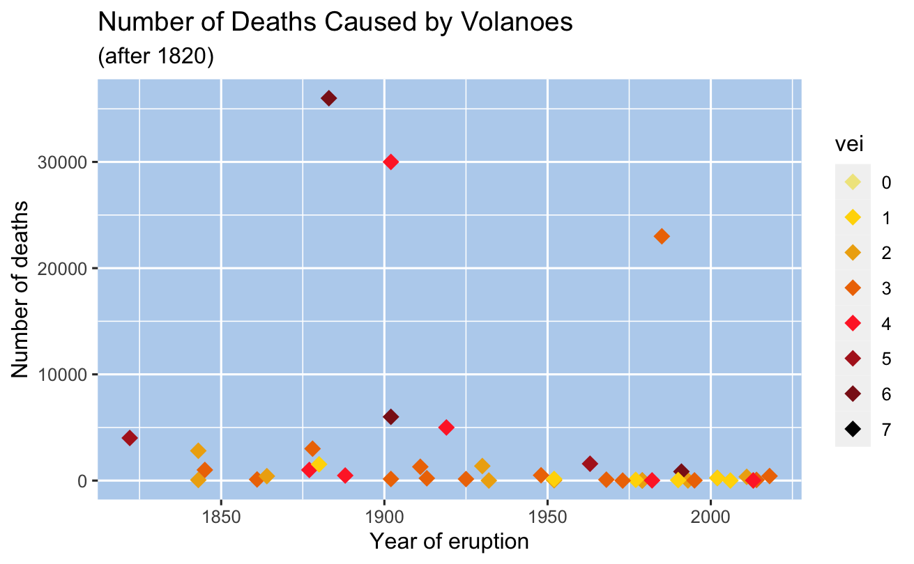

# Volcanoes

This project looks at the [Tidy Tuesday data on volcanoes](https://www.kaggle.com/jessemostipak/volcano-eruptions).

> A volcano is a rupture in the crust of a planetary-mass object, such as Earth, that allows hot lava, volcanic ash, and gases to escape from a magma chamber below the surface.
>
> Earth's volcanoes occur because its crust is broken into 17 major, rigid tectonic plates that float on a hotter, softer layer in its mantle. Therefore, on Earth, volcanoes are generally found where tectonic plates are diverging or converging, and most are found underwater.
>
> Erupting volcanoes can pose many hazards, not only in the immediate vicinity of the eruption. One such hazard is that volcanic ash can be a threat to aircraft, in particular those with jet engines where ash particles can be melted by the high operating temperature; the melted particles then adhere to the turbine blades and alter their shape, disrupting the operation of the turbine. Large eruptions can affect temperature as ash and droplets of sulfuric acid obscure the sun and cool the Earth's lower atmosphere (or troposphere); however, they also absorb heat radiated from the Earth, thereby warming the upper atmosphere (or stratosphere). Historically, volcanic winters have caused catastrophic famines.
>
> Wikipedia

My project looks at three questions:

## Question One: Where are volcanic eruptions likely to occur?

This was mostly split into work looking at the geographic location and the elevation of the volcanoes/

The majority of volcanoes erupt rarely (from what we know)

\- 27% have only erupted once

\- 72% 10 or fewer eruptions

\- 83% 20 or fewer

\- 95% 50 or fewer

But there are some volcanoes that we know erupt a lot.

8 of the volcanoes have known to have erupted at least 100 times.

### Question One Summary

Volcanoes are located along the tectonic plates.

75% are on the Ring of Fire - the plates circling the Pacific Ocean.

Almost half of the volcanoes are strato-volcanoes.

Elevation does not seem to matter.

Some volcanoes erupt many, many times but most hardly ever.

------------------------------------------------------------------------

## Question Two: Which volcanoes are likely to cause the most damage if they blow?

After 1820 there have been three large killers

-   1883 - Krakatoa in Indonesia, 36,000 killed

-   1902 - Pelee in Martinique, 30,000 killed

-   1985 - Nevado del Ruiz in Colombia, 23,000 killed

At present, about 800 million people live within 100 km of an active volcano - a distance well within reach of potentially lethal volcanic hazards. Of these, about 200 million are in Indonesia

------------------------------------------------------------------------

## Question Three: Why do people live near volcanoes when they are so lethal?

Source: [<https://www.turkvolc.com/eruption-size>](https://www.turkvolc.com/eruption-size){.uri}

### 

The majority of Indonesia's volcano are located on a 3,000 km long chain called the Sunda Arc. Here, the subduction of the Indian Ocean crust underneath the Asian Plate produced most of these volcanoes.

Indonesia has 147 volcanoes and 76 of them are active volcanoes

### Mount Tambora

-   Erupted in 1815

-   Deadliest eruption in recorded history

-   The caldera created is 4 miles across

-   The explosion immediately killed around 10,000 people

-   Believed to eventually be responsible for around 100,000 deaths

-   Triggered 'The Year Without Summer'

### The Year Without Summer

Europe's summer temperatures were the coldest on record since 1766. There were northern hemisphere food shortages. Record numbers of people starved to death in Paris in 1816. There was famine in China, the monsoon season was disrupted causing widespread flooding in the Yangtze valley.

Paintings of the time showed the colour of the sky as yellow due to the particles in the stratosphere.

Mary Shelley wrote Frankenstein as she was forced to spend so much time indoors due to the horrific weather.

### Question Three Summary

Often people have no choice about where they live. Volcanoes don't always give warning about imminent explosions. Scientists are getting better at predicting eruptions by monitoring the cones and seismic activity.

Volcano tourism has become a thing with travellers wanting to look into the cones and have the experience.

> On 9 December 2019 Whakaari / White Island, an active stratovolcano island in New Zealand's north-eastern Bay of Plenty region explosively erupted. The island was a popular tourist destination, known for its volcanic activity, and 47 people were on the island at the time. Twenty-two people died, either in the explosion or from injuries sustained, including two whose bodies were never found and were later declared dead. A further 25 people suffered injuries, with the majority needing intensive care for severe burns. The ongoing seismic and volcanic activity in the area as well as heavy rainfall, low visibility and toxic gases hampered recovery efforts over the week following the incident. (Wikipedia)
