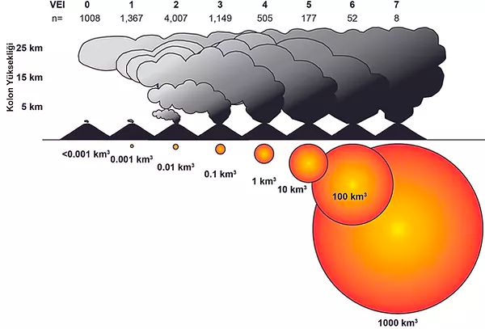

# Background

> A volcano is a rupture in the crust of a planetary-mass object, such as Earth, that allows hot lava, volcanic ash, and gases to escape from a magma chamber below the surface.
>
> Earth's volcanoes occur because its crust is broken into 17 major, rigid tectonic plates that float on a hotter, softer layer in its mantle. Therefore, on Earth, volcanoes are generally found where tectonic plates are diverging or converging, and most are found underwater.
>
> Erupting volcanoes can pose many hazards, not only in the immediate vicinity of the eruption. One such hazard is that volcanic ash can be a threat to aircraft, in particular those with jet engines where ash particles can be melted by the high operating temperature; the melted particles then adhere to the turbine blades and alter their shape, disrupting the operation of the turbine. Large eruptions can affect temperature as ash and droplets of sulfuric acid obscure the sun and cool the Earth's lower atmosphere (or troposphere); however, they also absorb heat radiated from the Earth, thereby warming the upper atmosphere (or stratosphere). Historically, volcanic winters have caused catastrophic famines.
>
> Wikipedia

# Questions

We all know what a volcano is but how doe we really understand about them? Using datasets originally created as part of Tidy Tuesday (A weekly data project aimed at the R ecosystem) I want to learn more about them focusing on three questions:

1\. Where are volcanic eruptions likely to occur

2\. Which volcanoes are likely to cause the most damage if they blow?

3\. Why do people live near volcanoes when they are so lethal?

# Data

## Sources

Main source: <https://www.kaggle.com/jessemostipak/volcano-eruptions>

The data was downloaded and cleaned by [Thomas Mock](https://twitter.com/thomas_mock) for [#TidyTuesday](https://github.com/rfordatascience/tidytuesday) during the week of May 11th, 2020. You can see the code used to clean the data in the [#TidyTuesday GitHub repository](https://github.com/rfordatascience/tidytuesday/blob/master/data/2020/2020-05-12/readme.md).

## Datasets

### Eruptions

11178 rows, 15 columns

| Name                   | Description                           | Data Type | NAs  | Action            |
|------------------------|---------------------------------------|-----------|------|-------------------|
| volcano number         | volcano unique ID                     | numeric   | 0    |                   |
| volcano name           | name                                  | character | 0    |                   |
| eruption number        | eruption unique ID                    | numeric   | 0    |                   |
| eruption category      | category                              | character | 0    |                   |
| area of activity       | area of activity (on volcano)         | character | 6484 | Remove column     |
| vei                    | volcanic explosive index (0-8)        | numeric   | 2906 |                   |
| start year             | start year                            | numeric   | 1    | Remove one NA row |
| start month            | start month                           | numeric   | 193  | Remove column     |
| start day              | start day                             | numeric   | 196  | Remove column     |
| evidence method dating | evidence for dating volcanic eruption | character | 0    |                   |
| end year               | end year                              | numeric   | 6846 | Remove column     |
| end month              | end month                             | numeric   | 6849 | Remove column     |
| end day                | end day                               | numeric   | 6852 | Remove column     |
| latitude               | latitude                              | numeric   | 0    |                   |
| longitude              | longitude                             | numeric   | 0    |                   |

#### Cleaning Needed

-   Lubridate dates or decide how to treat the dates - as that is where the majority of the NAs are

-   Split into modern and historic eruptions

As the end year/month/date is missing from over 60% of the dataset I am going to drop these three columns of data.

The start month/day is missing from just 1.7% of the data. There are however 45% where the month is classed as '0' which could also be considered to be a missing value. I am also going to drop the start month and date - just leaving the start year as the only date field in the dataset.

There is one eruption that has NA for a start year and I am going to drop this one row.

### Events

41322 rows, 10 variables

+---------------------+--------------------+-----------+-------------+--------------------------------------------------+
| Name                | Description        | Data Type | NAs         | Action                                           |
+=====================+====================+===========+=============+==================================================+
| volcano number      | volcano unique ID  | numeric   | 0           |                                                  |
+---------------------+--------------------+-----------+-------------+--------------------------------------------------+
| volcano name        | name               | character | 0           |                                                  |
+---------------------+--------------------+-----------+-------------+--------------------------------------------------+
| eruption number     | eruption unique ID | numeric   | 0           |                                                  |
+---------------------+--------------------+-----------+-------------+--------------------------------------------------+
| eruption start year |                    | numeric   | 0           |                                                  |
+---------------------+--------------------+-----------+-------------+--------------------------------------------------+
| event number        |                    | numeric   | 0           |                                                  |
+---------------------+--------------------+-----------+-------------+--------------------------------------------------+
| event type          |                    | character | 0           |                                                  |
+---------------------+--------------------+-----------+-------------+--------------------------------------------------+
| event remarks       |                    | character | 36442 (88%) | Create subset of comments and then remove column |
+---------------------+--------------------+-----------+-------------+--------------------------------------------------+
| event date year     |                    | numeric   | 31315 (76%) | Remove Column                                    |
+---------------------+--------------------+-----------+-------------+--------------------------------------------------+
| event date month    |                    | numeric   | 34190 (83%) | Remove Column                                    |
+---------------------+--------------------+-----------+-------------+--------------------------------------------------+
| event date day      |                    | numeric   | 35399 (86%) | Remove Column                                    |
+---------------------+--------------------+-----------+-------------+--------------------------------------------------+

#### Cleaning Needed

-   Remove the event date columns as over 75% are NAs

-   The event remarks column is only 12% populated. I am going to create a subset of those with comments and then remove it from the main dataset.

### Sulfur

2252 rows, 3 variables

Data on sulfur detection from melting ice cores (in ng) in Greenland and Antarctica.

+------+------------------------------------------------------------------------------------------------------------------------------------------------------------------------------------+-----------+-----+
| Name | Description                                                                                                                                                                        | Data Type | NAs |
+======+====================================================================================================================================================================================+===========+=====+
| year | Year w/ decimal CE                                                                                                                                                                 | numeric   | 290 |
+------+------------------------------------------------------------------------------------------------------------------------------------------------------------------------------------+-----------+-----+
| neem | Sulfur detected in ng/g from NEEM (North Greenland Eemian Ice Drilling) - ice cores from Greenland, data collected from melting ice cores, data range was 500 to 705 CE            | numeric   | 290 |
+------+------------------------------------------------------------------------------------------------------------------------------------------------------------------------------------+-----------+-----+
| wdc  | Sulfur detected in ng/g from WDC (West Antarctic Ice Sheet (WAIS) Divide ice core) - ice cores from Antartica, data collected from melting ice cores, data range was 500 to 705 CE | numeric   | 0   |
+------+------------------------------------------------------------------------------------------------------------------------------------------------------------------------------------+-----------+-----+

Action: remove all rows where year and neem is NA

### Tree Rings

2252 rows, 3 variables

+-------------------+-------------------------------------------------------------------------------------------------------------------------------------+-----------+-------+
| Name              | Description                                                                                                                         | Data Type | NAs   |
+===================+=====================================================================================================================================+===========+=======+
| year              | Year of observation                                                                                                                 | numeric   | 252   |
+-------------------+-------------------------------------------------------------------------------------------------------------------------------------+-----------+-------+
| n tree            | Tree ring z-scores relative to year = 1000-1099 (a z-score is a measure of variability from the mean - either positive or negative) | numeric   | 252   |
+-------------------+-------------------------------------------------------------------------------------------------------------------------------------+-----------+-------+
| europe temp index | Pages 2K Temperature for Europe in Celsius relative to 1961 to 1990                                                                 | numeric   | 252   |
+-------------------+-------------------------------------------------------------------------------------------------------------------------------------+-----------+-------+

Action: remove all NA rows

### Volcano

958 rows, 26 variables

+----------------------+---------------------------------------------------------------------+-----------+---------------------+------------------------+
| Name                 | Description                                                         | Data Type | NAs                 | Action                 |
+======================+=====================================================================+===========+=====================+========================+
| volcano number       | volcano unique ID                                                   | number    | 0                   |                        |
+----------------------+---------------------------------------------------------------------+-----------+---------------------+------------------------+
| volcano name         | volcano name                                                        | character | 0                   |                        |
+----------------------+---------------------------------------------------------------------+-----------+---------------------+------------------------+
| primary volcano type | volcano type                                                        | character | 0                   |                        |
+----------------------+---------------------------------------------------------------------+-----------+---------------------+------------------------+
| last eruption year   | Year volcano last erupted                                           | character | 0                   |                        |
+----------------------+---------------------------------------------------------------------+-----------+---------------------+------------------------+
| country              | country                                                             | character | 0                   |                        |
+----------------------+---------------------------------------------------------------------+-----------+---------------------+------------------------+
| region               | region                                                              | character | 0                   |                        |
+----------------------+---------------------------------------------------------------------+-----------+---------------------+------------------------+
| subregion            | subregion                                                           | character | 0                   |                        |
+----------------------+---------------------------------------------------------------------+-----------+---------------------+------------------------+
| latitude             | latitude                                                            | number    | 0                   |                        |
+----------------------+---------------------------------------------------------------------+-----------+---------------------+------------------------+
| longitude            | longitude                                                           | number    | 0                   |                        |
+----------------------+---------------------------------------------------------------------+-----------+---------------------+------------------------+
| elevation            | elevation                                                           | number    | 0                   |                        |
+----------------------+---------------------------------------------------------------------+-----------+---------------------+------------------------+
| tectonic settings    | Plate tectonic settings (subduction, intraplate, rift zone) + crust | character | 0                   | Split into two columns |
+----------------------+---------------------------------------------------------------------+-----------+---------------------+------------------------+
| evidence category    | Type of evidence                                                    | character | 0                   |                        |
+----------------------+---------------------------------------------------------------------+-----------+---------------------+------------------------+
| major rock 1         | major rock 1                                                        | character | 0                   |                        |
+----------------------+---------------------------------------------------------------------+-----------+---------------------+------------------------+
| major rock 2         | major rock 2                                                        | character | Some missing values | Remove Column          |
+----------------------+---------------------------------------------------------------------+-----------+---------------------+------------------------+
| major rock 3         | major rock 3                                                        | character | Some missing values | Remove Column          |
+----------------------+---------------------------------------------------------------------+-----------+---------------------+------------------------+
| major rock 4         | major rock 4                                                        | character | Some missing values | Remove Column          |
+----------------------+---------------------------------------------------------------------+-----------+---------------------+------------------------+
| major rock 5         | major rock 5                                                        | character | Some missing values | Remove Column          |
+----------------------+---------------------------------------------------------------------+-----------+---------------------+------------------------+
| minor rock 1         | minor rock 1                                                        | character | Some missing values | Remove Column          |
+----------------------+---------------------------------------------------------------------+-----------+---------------------+------------------------+
| minor rock 2         | minor rock 2                                                        | character | Some missing values | Remove Column          |
+----------------------+---------------------------------------------------------------------+-----------+---------------------+------------------------+
| minor rock 3         | minor rock 3                                                        | character | Some missing values | Remove Column          |
+----------------------+---------------------------------------------------------------------+-----------+---------------------+------------------------+
| minor rock 4         | minor rock 4                                                        | character | Some missing values | Remove Column          |
+----------------------+---------------------------------------------------------------------+-----------+---------------------+------------------------+
| minor rock 5         | minor rock 5                                                        | character | Some missing values | Remove Column          |
+----------------------+---------------------------------------------------------------------+-----------+---------------------+------------------------+
| popn within 5km      | Population within 5km of volcano                                    | number    | 0                   |                        |
+----------------------+---------------------------------------------------------------------+-----------+---------------------+------------------------+
| popn within 10km     | Population within 10km of volcano                                   | number    | 0                   |                        |
+----------------------+---------------------------------------------------------------------+-----------+---------------------+------------------------+
| popn within 30km     | Population within 30km of volcano                                   | number    | 0                   |                        |
+----------------------+---------------------------------------------------------------------+-----------+---------------------+------------------------+
| popn within 100km    | Population within 100km of volcano                                  | number    | 0                   |                        |
+----------------------+---------------------------------------------------------------------+-----------+---------------------+------------------------+

Split the tectonic settings column into zone and crust and delete the original column.

Remove the additional rock columns as not needed for analysis.

### VEI Scale

Volcanic Explosivity Index

9 rows, 7 variables

+-------------------------+-------------------------------------+-----------------+-----------------------------------+
| Name                    | Description                         | Data Type       | Action                            |
+=========================+=====================================+=================+===================================+
| vei                     | VEI number                          | Numeric         | Change to function for analysis   |
|                         |                                     |                 |                                   |
|                         | (Volcanic Explosivity Index)        |                 |                                   |
+-------------------------+-------------------------------------+-----------------+-----------------------------------+
| classification          | classification name                 | character       |                                   |
+-------------------------+-------------------------------------+-----------------+-----------------------------------+
| description             | description of effect               | character       |                                   |
+-------------------------+-------------------------------------+-----------------+-----------------------------------+
| plume                   | size/scale of plume                 | character       |                                   |
+-------------------------+-------------------------------------+-----------------+-----------------------------------+
| frequency               | frequency                           | character       |                                   |
+-------------------------+-------------------------------------+-----------------+-----------------------------------+
| tropospheric injection  | effect on the troposphere           | character       |                                   |
+-------------------------+-------------------------------------+-----------------+-----------------------------------+
| stratospheric injection | effect on the stratosphere          | character       |                                   |
+-------------------------+-------------------------------------+-----------------+-----------------------------------+

## Data formats

The datasets used for this analysis were all provided as .csv files and were very easy to import. I went through each table to look at the data in each one. If a column had any NAs I considered how to treat this.

The one field that contains the date has been left as numeric as lubridate doesn't cope with years before 0. I may reconsider this at the analysis stage.

Likewise some of the comments have been removed from the eruption table but I may come back to this if I need explanations for data.

The volcano table contained 10 columns looking at the type of rocks the volcanoes are made from - as only one of these 10 was completely populated I removed the other nine for simplicity.

## Data quality and bias

The data is an interesting mix of accurate reporting and guesswork. This is a reflection of the nature of the data. We can say a lot more about a volcano that erupted in the last 50 years than one that erupted 1000 or even 10000 years ago. I can assume that the quality of the data therefore improves over time - and I may need to filter out some of the less accurate data for this reason at the analysis stage.

I can't think of any reason why there would be intentional bias in the data apart from the historical issue already mentioned.

Perhaps one consideration could be that volcanoes erupting underwater or in less populates areas would have less data and analysis done on them.

# Ethics

The only ethical considerations on the datasets is to consider the local populations living near volcanoes. I do intend to consider the reasons behind people living in close proximity to volcanoes and perhaps there will be some ethical considerations to make at that point. The majority of the data relates to the physical makeup of the volcanoes.

# Analysis

## Explaining the VEI

VEI is the the Volcanic Explosivity Index and is a measure of how explosive a volcano is.

> With indices running from 0 to 8, the VEI associated with an eruption is dependent on how much volcanic material is thrown out, to what height, and how long the eruption lasts. The scale is logarithmic from VEI-2 and up; an increase of 1 index indicates an eruption that is 10 times as powerful. As such, there is a discontinuity in the definition of the VEI between indices 1 and 2. The lower border of the volume of ejecta jumps by a factor of one hundred, from 10,000 to 1,000,000 m^3^ (350,000 to 35,310,000 cu ft), while the factor is ten between all higher indices. In the following table, the frequency of each VEI indicates the approximate frequency of new eruptions of that VEI or higher.

The scale can be summarised by the following image. The number below the scale value shows how many eruptions have been recorded in each VEI bracket in the last 10,000 years.

Source: <https://www.turkvolc.com/eruption-size>

### Population and VEI

We know the population within 5, 10, 30 and 100km

We know the last time a volcano blew

We know what the VEI of the last eruption.

If we assume that a volcano eruption will be at least the same as the previous eruption where is the biggest population at risk?

Returning to the volcano database we need to build it for the population analysis. What we need is the volcano details, removing those where there is no eruption details. Then we need to determine the year of the last eruption, how many eruptions have their been and what is the average VEI for each volcano.

> At present, about 800 million people live within 100 km of an active volcano - a distance well within reach of potentially lethal volcanic hazards. Of these, about 200 million are in Indonesia. Source: <https://www.bbc.co.uk/news/world-us-canada-44212666>

> Every year about 60 volcanoes erupt. Some take us by surprise but others are regular offenders.
>
> Since the year 1500, about 280,000 people have been killed by volcanoes - 170,000 of those by just six eruptions.
>
> We have compiled [**these figures**](http://globalvolcanomodel.org/volcanic-fatalities/) using media reports, public records and historical documents.
>
> About 2,000 people have been killed since the year 2000.
>
> Most people killed by volcanoes are the victims of pyroclastic flows and lahars - volcanic mudflows, packed with debris - which have been responsible for about 120,000 deaths over the last 500 years.
>
> These are normally associated with large conical volcanoes found at tectonic boundaries, such as the ring of fire, unlike the gently sloping shield volcanoes, like Kilauea.
>
> Pyroclastic flows are very fast avalanches of rock, ash and gas, which can reach temperatures of 700C.
>
> They destroy everything in their path, and death is near certain for anyone caught in their way.
>
> It was pyroclastic flows that destroyed the Roman city of Pompeii in AD 79. And they claimed nearly 30,000 lives on the Caribbean island of Martinique in 1902.

## Initial Analysis

Prompted by importing the datasets what analysis is needed?

### Eruption Dataset

-   Look at what VEI means and look at the range of values

-   How many eruptions per volcano

-   How many in each category

-   Timeline of eruptions

Stages in the data analysis process

What were the main stages in your data analysis process?

Tools for data analysis

What were the main tools you used for your analysis?

Descriptive, diagnostic, predictive and prescriptive analysis

Please report under which of the below categories your analysis falls and why (can be more than one)

Descriptive Analytics tells you what happened in the past.

Diagnostic Analytics helps you understand why something happened in the past.

Predictive Analytics predicts what is most likely to happen in the future.

Prescriptive Analytics recommends actions you can take to affect those outcomes.

# Maps

Tectonic plates from: <https://github.com/fraxen/tectonicplates>

# Appendix

## Data Requirements

The data you use in the project has to meet the following criteria:

At least 5,000 rows

At least 3 sources of data

Must contain text data, numeric data and dates

Most of the data supplied with the briefs do meet the requirements, but we recommend that you personally make sure that you are indeed meeting these criteria. If your current datasets do not, you are more than welcome to supplement your analysis with further datasets that would help you meet the requirements.

Product Requirements

Your actual final project analysis process will remain largely the same regardless if you are completing the PDA or not. However, you will need to do a bit more formal planning/documentation of your project for the PDA.

## PDA Outcomes

Working with Data (J4Y6 35)

1.  Plan an analysis to provide business intelligence

1.1 Business intelligence and data-driven decision making

1.2 Domain knowledge and the business context

1.4 Internal and external data sources

1.5 Data quality

1.6 Stages in the data analysis process

1.7 Descriptive, diagnostic, predictive and prescriptive analysis

1.9 Ethical implications of business requirements

1.10 Tools for data analysis

2.  Extract data from a variety of sources

2.1 Tools for querying data sources

2.2 Types of data (categorical and numerical data and their sub-types)

2.3 Data formats

2.6 Data quality including data bias

2.7 Ethical issues in data sourcing and extraction

4.  Analyse data to provide business intelligence

4.7 Role of domain knowledge in interpreting analyses
