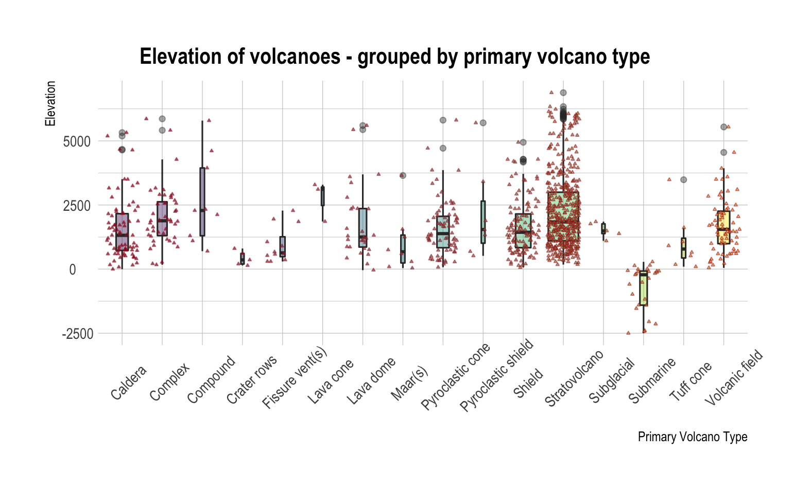
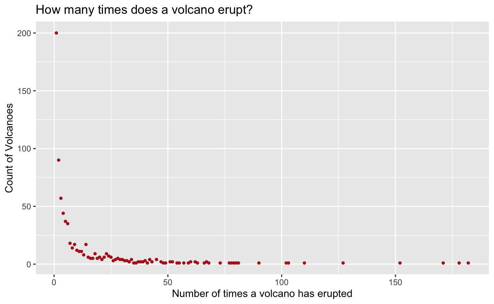
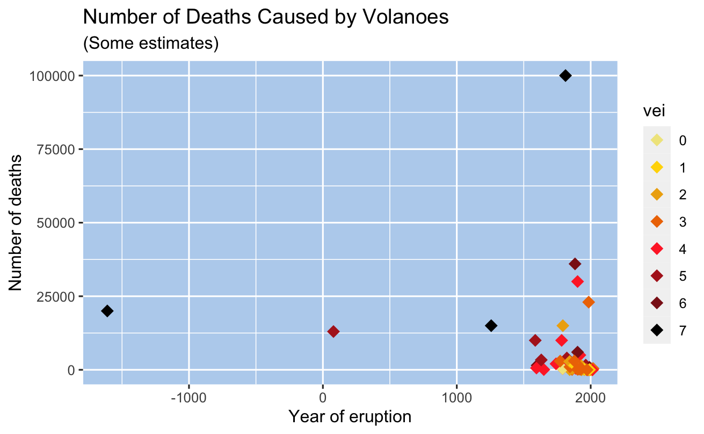
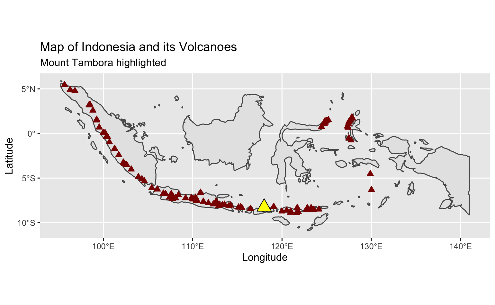

# Background

> A volcano is a rupture in the crust of a planetary-mass object, such as Earth, that allows hot lava, volcanic ash, and gases to escape from a magma chamber below the surface.
>
> Earth's volcanoes occur because its crust is broken into 17 major, rigid tectonic plates that float on a hotter, softer layer in its mantle. Therefore, on Earth, volcanoes are generally found where tectonic plates are diverging or converging, and most are found underwater.
>
> Erupting volcanoes can pose many hazards, not only in the immediate vicinity of the eruption. One such hazard is that volcanic ash can be a threat to aircraft, in particular those with jet engines where ash particles can be melted by the high operating temperature; the melted particles then adhere to the turbine blades and alter their shape, disrupting the operation of the turbine. Large eruptions can affect temperature as ash and droplets of sulfuric acid obscure the sun and cool the Earth's lower atmosphere (or troposphere); however, they also absorb heat radiated from the Earth, thereby warming the upper atmosphere (or stratosphere). Historically, volcanic winters have caused catastrophic famines.
>
> Wikipedia

------------------------------------------------------------------------

# Questions

We all know what a volcano is but how doe we really understand about them? Using datasets originally created as part of Tidy Tuesday (A weekly data project aimed at the R ecosystem) I want to learn more about them focusing on two questions:

1\. Where are volcanic eruptions likely to occur

2\. Which volcanoes are likely to cause the most damage if they blow?

------------------------------------------------------------------------

# Data

## Sources

Main source: <https://www.kaggle.com/jessemostipak/volcano-eruptions>

The data was downloaded and cleaned by [Thomas Mock](https://twitter.com/thomas_mock) for [#TidyTuesday](https://github.com/rfordatascience/tidytuesday) during the week of May 11th, 2020. You can see the code used to clean the data in the [#TidyTuesday GitHub repository](https://github.com/rfordatascience/tidytuesday/blob/master/data/2020/2020-05-12/readme.md).

## Datasets

### Eruptions

11178 rows, 15 columns

| Name                   | Description                           | Data Type | NAs  | Action            |
|------------------------|---------------------------------------|-----------|------|-------------------|
| volcano number         | volcano unique ID                     | numeric   | 0    |                   |
| volcano name           | name                                  | character | 0    |                   |
| eruption number        | eruption unique ID                    | numeric   | 0    |                   |
| eruption category      | category                              | character | 0    |                   |
| area of activity       | area of activity (on volcano)         | character | 6484 | Remove column     |
| vei                    | volcanic explosive index (0-8)        | numeric   | 2906 |                   |
| start year             | start year                            | numeric   | 1    | Remove one NA row |
| start month            | start month                           | numeric   | 193  | Remove column     |
| start day              | start day                             | numeric   | 196  | Remove column     |
| evidence method dating | evidence for dating volcanic eruption | character | 0    |                   |
| end year               | end year                              | numeric   | 6846 | Remove column     |
| end month              | end month                             | numeric   | 6849 | Remove column     |
| end day                | end day                               | numeric   | 6852 | Remove column     |
| latitude               | latitude                              | numeric   | 0    |                   |
| longitude              | longitude                             | numeric   | 0    |                   |

#### Cleaning Needed

-   Lubridate dates or decide how to treat the dates - as that is where the majority of the NAs are

-   Split into modern and historic eruptions

As the end year/month/date is missing from over 60% of the dataset I am going to drop these three columns of data.

The start month/day is missing from just 1.7% of the data. There are however 45% where the month is classed as '0' which could also be considered to be a missing value. I am also going to drop the start month and date - just leaving the start year as the only date field in the dataset.

There is one eruption that has NA for a start year and I am going to drop this one row.

### Events

41322 rows, 10 variables

+---------------------+--------------------+-----------+-------------+--------------------------------------------------+
| Name                | Description        | Data Type | NAs         | Action                                           |
+=====================+====================+===========+=============+==================================================+
| volcano number      | volcano unique ID  | numeric   | 0           |                                                  |
+---------------------+--------------------+-----------+-------------+--------------------------------------------------+
| volcano name        | name               | character | 0           |                                                  |
+---------------------+--------------------+-----------+-------------+--------------------------------------------------+
| eruption number     | eruption unique ID | numeric   | 0           |                                                  |
+---------------------+--------------------+-----------+-------------+--------------------------------------------------+
| eruption start year |                    | numeric   | 0           |                                                  |
+---------------------+--------------------+-----------+-------------+--------------------------------------------------+
| event number        |                    | numeric   | 0           |                                                  |
+---------------------+--------------------+-----------+-------------+--------------------------------------------------+
| event type          |                    | character | 0           |                                                  |
+---------------------+--------------------+-----------+-------------+--------------------------------------------------+
| event remarks       |                    | character | 36442 (88%) | Create subset of comments and then remove column |
+---------------------+--------------------+-----------+-------------+--------------------------------------------------+
| event date year     |                    | numeric   | 31315 (76%) | Remove Column                                    |
+---------------------+--------------------+-----------+-------------+--------------------------------------------------+
| event date month    |                    | numeric   | 34190 (83%) | Remove Column                                    |
+---------------------+--------------------+-----------+-------------+--------------------------------------------------+
| event date day      |                    | numeric   | 35399 (86%) | Remove Column                                    |
+---------------------+--------------------+-----------+-------------+--------------------------------------------------+

#### Cleaning Needed

-   Remove the event date columns as over 75% are NAs

-   The event remarks column is only 12% populated. I am going to create a subset of those with comments and then remove it from the main dataset.

### Sulfur

2252 rows, 3 variables

Data on sulfur detection from melting ice cores (in ng) in Greenland and Antarctica.

+------+------------------------------------------------------------------------------------------------------------------------------------------------------------------------------------+-----------+-----+
| Name | Description                                                                                                                                                                        | Data Type | NAs |
+======+====================================================================================================================================================================================+===========+=====+
| year | Year w/ decimal CE                                                                                                                                                                 | numeric   | 290 |
+------+------------------------------------------------------------------------------------------------------------------------------------------------------------------------------------+-----------+-----+
| neem | Sulfur detected in ng/g from NEEM (North Greenland Eemian Ice Drilling) - ice cores from Greenland, data collected from melting ice cores, data range was 500 to 705 CE            | numeric   | 290 |
+------+------------------------------------------------------------------------------------------------------------------------------------------------------------------------------------+-----------+-----+
| wdc  | Sulfur detected in ng/g from WDC (West Antarctic Ice Sheet (WAIS) Divide ice core) - ice cores from Antartica, data collected from melting ice cores, data range was 500 to 705 CE | numeric   | 0   |
+------+------------------------------------------------------------------------------------------------------------------------------------------------------------------------------------+-----------+-----+

Action: remove all rows where year and neem is NA

### Tree Rings

2252 rows, 3 variables

+-------------------+-------------------------------------------------------------------------------------------------------------------------------------+-----------+-------+
| Name              | Description                                                                                                                         | Data Type | NAs   |
+===================+=====================================================================================================================================+===========+=======+
| year              | Year of observation                                                                                                                 | numeric   | 252   |
+-------------------+-------------------------------------------------------------------------------------------------------------------------------------+-----------+-------+
| n tree            | Tree ring z-scores relative to year = 1000-1099 (a z-score is a measure of variability from the mean - either positive or negative) | numeric   | 252   |
+-------------------+-------------------------------------------------------------------------------------------------------------------------------------+-----------+-------+
| europe temp index | Pages 2K Temperature for Europe in Celsius relative to 1961 to 1990                                                                 | numeric   | 252   |
+-------------------+-------------------------------------------------------------------------------------------------------------------------------------+-----------+-------+

Action: remove all NA rows

### Volcano

958 rows, 26 variables

+----------------------+---------------------------------------------------------------------+-----------+---------------------+------------------------+
| Name                 | Description                                                         | Data Type | NAs                 | Action                 |
+======================+=====================================================================+===========+=====================+========================+
| volcano number       | volcano unique ID                                                   | number    | 0                   |                        |
+----------------------+---------------------------------------------------------------------+-----------+---------------------+------------------------+
| volcano name         | volcano name                                                        | character | 0                   |                        |
+----------------------+---------------------------------------------------------------------+-----------+---------------------+------------------------+
| primary volcano type | volcano type                                                        | character | 0                   |                        |
+----------------------+---------------------------------------------------------------------+-----------+---------------------+------------------------+
| last eruption year   | Year volcano last erupted                                           | character | 0                   |                        |
+----------------------+---------------------------------------------------------------------+-----------+---------------------+------------------------+
| country              | country                                                             | character | 0                   |                        |
+----------------------+---------------------------------------------------------------------+-----------+---------------------+------------------------+
| region               | region                                                              | character | 0                   |                        |
+----------------------+---------------------------------------------------------------------+-----------+---------------------+------------------------+
| subregion            | subregion                                                           | character | 0                   |                        |
+----------------------+---------------------------------------------------------------------+-----------+---------------------+------------------------+
| latitude             | latitude                                                            | number    | 0                   |                        |
+----------------------+---------------------------------------------------------------------+-----------+---------------------+------------------------+
| longitude            | longitude                                                           | number    | 0                   |                        |
+----------------------+---------------------------------------------------------------------+-----------+---------------------+------------------------+
| elevation            | elevation                                                           | number    | 0                   |                        |
+----------------------+---------------------------------------------------------------------+-----------+---------------------+------------------------+
| tectonic settings    | Plate tectonic settings (subduction, intraplate, rift zone) + crust | character | 0                   | Split into two columns |
+----------------------+---------------------------------------------------------------------+-----------+---------------------+------------------------+
| evidence category    | Type of evidence                                                    | character | 0                   |                        |
+----------------------+---------------------------------------------------------------------+-----------+---------------------+------------------------+
| major rock 1         | major rock 1                                                        | character | 0                   |                        |
+----------------------+---------------------------------------------------------------------+-----------+---------------------+------------------------+
| major rock 2         | major rock 2                                                        | character | Some missing values | Remove Column          |
+----------------------+---------------------------------------------------------------------+-----------+---------------------+------------------------+
| major rock 3         | major rock 3                                                        | character | Some missing values | Remove Column          |
+----------------------+---------------------------------------------------------------------+-----------+---------------------+------------------------+
| major rock 4         | major rock 4                                                        | character | Some missing values | Remove Column          |
+----------------------+---------------------------------------------------------------------+-----------+---------------------+------------------------+
| major rock 5         | major rock 5                                                        | character | Some missing values | Remove Column          |
+----------------------+---------------------------------------------------------------------+-----------+---------------------+------------------------+
| minor rock 1         | minor rock 1                                                        | character | Some missing values | Remove Column          |
+----------------------+---------------------------------------------------------------------+-----------+---------------------+------------------------+
| minor rock 2         | minor rock 2                                                        | character | Some missing values | Remove Column          |
+----------------------+---------------------------------------------------------------------+-----------+---------------------+------------------------+
| minor rock 3         | minor rock 3                                                        | character | Some missing values | Remove Column          |
+----------------------+---------------------------------------------------------------------+-----------+---------------------+------------------------+
| minor rock 4         | minor rock 4                                                        | character | Some missing values | Remove Column          |
+----------------------+---------------------------------------------------------------------+-----------+---------------------+------------------------+
| minor rock 5         | minor rock 5                                                        | character | Some missing values | Remove Column          |
+----------------------+---------------------------------------------------------------------+-----------+---------------------+------------------------+
| popn within 5km      | Population within 5km of volcano                                    | number    | 0                   |                        |
+----------------------+---------------------------------------------------------------------+-----------+---------------------+------------------------+
| popn within 10km     | Population within 10km of volcano                                   | number    | 0                   |                        |
+----------------------+---------------------------------------------------------------------+-----------+---------------------+------------------------+
| popn within 30km     | Population within 30km of volcano                                   | number    | 0                   |                        |
+----------------------+---------------------------------------------------------------------+-----------+---------------------+------------------------+
| popn within 100km    | Population within 100km of volcano                                  | number    | 0                   |                        |
+----------------------+---------------------------------------------------------------------+-----------+---------------------+------------------------+

Split the tectonic settings column into zone and crust and delete the original column.

Remove the additional rock columns as not needed for analysis.

### VEI Scale

Volcanic Explosivity Index

9 rows, 7 variables

+-------------------------+------------------------------+--------------+---------------------------------+
| Name                    | Description                  | Data Type    | Action                          |
+=========================+==============================+==============+=================================+
| vei                     | VEI number                   | Numeric      | Change to function for analysis |
|                         |                              |              |                                 |
|                         | (Volcanic Explosivity Index) |              |                                 |
+-------------------------+------------------------------+--------------+---------------------------------+
| classification          | classification name          | character    |                                 |
+-------------------------+------------------------------+--------------+---------------------------------+
| description             | description of effect        | character    |                                 |
+-------------------------+------------------------------+--------------+---------------------------------+
| plume                   | size/scale of plume          | character    |                                 |
+-------------------------+------------------------------+--------------+---------------------------------+
| frequency               | frequency                    | character    |                                 |
+-------------------------+------------------------------+--------------+---------------------------------+
| tropospheric injection  | effect on the troposphere    | character    |                                 |
+-------------------------+------------------------------+--------------+---------------------------------+
| stratospheric injection | effect on the stratosphere   | character    |                                 |
+-------------------------+------------------------------+--------------+---------------------------------+

## Data formats

The datasets used for this analysis were all provided as .csv files and were very easy to import. I went through each table to look at the data in each one. If a column had any NAs I considered how to treat this.

The one field that contains the date has been left as numeric as lubridate doesn't cope with years before 0. I may reconsider this at the analysis stage.

Likewise some of the comments have been removed from the eruption table but I may come back to this if I need explanations for data.

The volcano table contained 10 columns looking at the type of rocks the volcanoes are made from - as only one of these 10 was completely populated I removed the other nine for simplicity.

## Data quality and bias

The data is an interesting mix of accurate reporting and guesswork. This is a reflection of the nature of the data. We can say a lot more about a volcano that erupted in the last 50 years than one that erupted 1000 or even 10000 years ago. I can assume that the quality of the data therefore improves over time - and I may need to filter out some of the less accurate data for this reason at the analysis stage.

I can't think of any reason why there would be intentional bias in the data apart from the historical issue already mentioned.

Perhaps one consideration could be that volcanoes erupting underwater or in less populates areas would have less data and analysis done on them.

------------------------------------------------------------------------

# Ethics

The only ethical considerations on the datasets is to consider the local populations living near volcanoes. I do intend to consider the reasons behind people living in close proximity to volcanoes and perhaps there will be some ethical considerations to make at that point. The majority of the data relates to the physical make-up of the volcanoes.

------------------------------------------------------------------------

# Analysis

## Question One: Where are volcanic eruptions likely to occur?

### Explaining the VEI

VEI is the the Volcanic Explosivity Index and is a measure of how explosive a volcano is.

> With indices running from 0 to 8, the VEI associated with an eruption is dependent on how much volcanic material is thrown out, to what height, and how long the eruption lasts. The scale is logarithmic from VEI-2 and up; an increase of 1 index indicates an eruption that is 10 times as powerful. As such, there is a discontinuity in the definition of the VEI between indices 1 and 2. The lower border of the volume of ejecta jumps by a factor of one hundred, from 10,000 to 1,000,000 m^3^ (350,000 to 35,310,000 cu ft), while the factor is ten between all higher indices. In the following table, the frequency of each VEI indicates the approximate frequency of new eruptions of that VEI or higher.

The scale can be summarised by the following image. The number below the scale value shows how many eruptions have been recorded in each VEI bracket in the last 10,000 years.

Source: <https://www.turkvolc.com/eruption-size>

### Geographic Location

It is clear that volcanoes are located along the edges of the tectonic plates.

What other factors affect the location of active volcanoes?

### Elevation

The straight line patterns show repeated eruptions of the same volcano

Many more eruptions noticeable since 1800s as more events were being recorded.

Most of the eruptions had a VEI of 3 or below. (91%)\
Only 8 had a VEI of 7

No discernible pattern noticeable otherwise.

### Elevation by primary volcano type

No real pattern noticeable

There are a lot of strato-volcanoes - 48% and 12% are shield volcanoes.

### Number of Eruptions

The majority of volcanoes erupt rarely (from what we know)

\- 27% have only erupted once

\- 72% 10 or fewer eruptions

\- 83% 20 or fewer

\- 95% 50 or fewer

But there are some volcanoes that we know erupt a lot.

8 of the volcanoes have known to have erupted at least 100 times.

### Question One Summary

Volcanoes are located along the tectonic plates.

75% are on the Ring of Fire - the plates circling the Pacific Ocean.

Almost half of the volcanoes are strato-volcanoes.

Elevation does not seem to matter.

Some volcanoes erupt many, many times but most hardly ever.

------------------------------------------------------------------------

## Question Two: Which volcanoes are likely to cause the most damage if they blow?

### Nearby Population

Large number of deaths in 1815 (approx 100,000) - more on this later.

After 1820 there have been three large killers

-   1883 - Krakatoa in Indonesia, 36,000 killed

-   1902 - Pelee in Martinique, 30,000 killed

-   1985 - Nevado del Ruiz in Colombia, 23,000 killed

### Populations near Volcanoes

| Volcano Name             | Country      | Population within 10km |
|:-------------------------|:-------------|:----------------------:|
| Michoacan-Guanajuato     | Mexico       |        5783287         |
| Tatun Volcanic Group     | Taiwan       |        5084149         |
| Campi Flegrei            | Italy        |        2234109         |
| Ilopango                 | El Salvador  |        2049583         |
| Hainan Volcanic Field    | China        |        1731229         |
| San Pablo Volcanic Field | Philippines  |        1349742         |
| Ghegham Volcanic Ridge   | Armenia      |        1265153         |
| Dieng Volcanic Complex   | Indonesia    |        1092929         |
| Auckland Volcanic Field  | New Zealand  |        1049110         |
| Rahat, Harrat            | Saudi Arabia |        1010115         |

We know which volcanoes have high populations living near them. The top 10 are listed.

At present, about 800 million people live within 100 km of an active volcano - a distance well within reach of potentially lethal volcanic hazards. Of these, about 200 million are in Indonesia

### Indonesia

The majority of Indonesia's volcano are located on a 3,000 km long chain called the Sunda Arc. Here, the subduction of the Indian Ocean crust underneath the Asian Plate produced most of these volcanoes.

Indonesia has 147 volcanoes and 76 of them are active volcanoes

### Mount Tambora

-   Erupted in 1815

-   Deadliest eruption in recorded history

-   The caldera created is 4 miles across

-   The explosion immediately killed around 10,000 people

-   Believed to eventually be responsible for around 100,000 deaths

-   Triggered 'The Year Without Summer'

### The Year Without Summer

Europe's summer temperatures were the coldest on record since 1766. There were northern hemisphere food shortages. Record numbers of people starved to death in Paris in 1816. There was famine in China, the monsoon season was disrupted causing widespread flooding in the Yangtze valley.

Paintings of the time showed the colour of the sky as yellow due to the particles in the stratosphere.

Mary Shelley wrote Frankenstein as she was forced to spend so much time indoors due to the horrific weather.

### 

### Question Two Summary

The biggest impact will be felt on those with a large local population and those which blow with higher VEIs.

------------------------------------------------------------------------

## 

### Business Outcome

How can businesses use this analysis?

We know that volcanoes are primarily located along the tectonic plates - so the easy answer is don't base your business there. But that is not practical when we have already learned that millions of people live close to volcanoes.

Often people have no choice about where they live. Volcanoes don't always give warning about imminent explosions. Scientists are getting better at predicting eruptions by monitoring the cones and seismic activity.

Volcano tourism has become a thing with travellers wanting to look into the cones and have the experience.

> On 9 December 2019 Whakaari / White Island, an active stratovolcano island in New Zealand's north-eastern Bay of Plenty region explosively erupted. The island was a popular tourist destination, known for its volcanic activity, and 47 people were on the island at the time. Twenty-two people died, either in the explosion or from injuries sustained, including two whose bodies were never found and were later declared dead. A further 25 people suffered injuries, with the majority needing intensive care for severe burns. The ongoing seismic and volcanic activity in the area as well as heavy rainfall, low visibility and toxic gases hampered recovery efforts over the week following the incident. (Wikipedia)

We are a long way off having accurate predictions of imminent eruptions - so perhaps the best advice is to heed the warnings that local vulcanologists and geologists make.

------------------------------------------------------------------------

## Analysis Stages

Once the data was imported and cleaned the next step was to consider the three questions. How could the data help to answer these questions?

I created graphs, tables, summaries, maps to look at the data in different ways to pull out the answers to the questions and also to see if the data revealed anything not considered before.

## Analysis Tools

All of the analysis for this project was carried out in R, using R Studio. I used a range of packages for analysis and reporting. These included:

tidyverse

here

sf

rnaturalearth

ggplot2

rgeos

janitor

lubridate

gapminder

viridis

hrbrthemes

leaflet

### Descriptive Analytics

The prominent type of analysis carried out - looking at what has happened in the past. Which volcanoes have erupted, when, where and the impact of it.

### Diagnostic Analytics

Some of this type of analysis was used to help me understand why volcanoes erupt, as well as where and when.

### Predictive Analytics

This is perhaps the hardest section of analysis for volcanoes and much of the reading I have done has called out how near-impossible it is to say when a volcano is going to blow.

There are some examples of universities using machine learning and AI to try and model volcano activity and predict eruptions. For example a study at Leeds University has been using changes in satellite photographs to monitor the sides of volcanoes, looking for shifting rocks which could potentially mean an eruption. (<https://www.nature.com/articles/d41586-019-00752-3>)

Another report was looking at comparing volcanoes and earthquakes and seeing if one could predict the other. (<https://www.intechopen.com/chapters/57502>)

Perhaps if I was a vulcanologist I could go into much more detail and have a better understanding on the main conditions which can predict eruptions. Or perhaps even with years and years of experience a volcano may surprise us all and just blow.

### Prescriptive Analysis

Using all of the analysis throughout the project it is possible to answer the original questions. Perhaps not with clear and meaningful answers - but certainly some answers can be derived.
